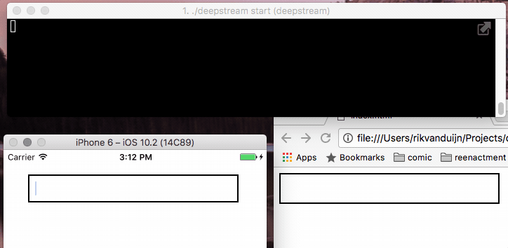

[React Native](https://facebook.github.io/react-native/) lets you build mobile apps using only JavaScript. It uses the same design as React, letting you compose a rich mobile UI from declarative components.

Now that deepstream implements websockets, integrating it with your React Native app via the [JS connector](/docs/client-js/client/) has become a breeze. The following steps will take you through the process with a hello world-esque example ([skip to solution](#8-complete-)).



## 1. Start the server

Let's start by installing the server. Just pick the [right version for your operating system](/install/) and follow its steps. Once the server is installed, you can start it with:

```bash
deepstream start
```

## 2. Set up the HTML side (optional)

To try some quick tests between the React Native Simulator and a browser window, you can set up an HTML side folliwing the [quickstart guide](/tutorials/core/getting-started-quickstart/).

## 3. Initialize and run a new React Native application

First initialize the project in your terminal
```bash
react-native init DeepstreamReactNative
```

Move into the project folder
```bash
cd DeepstreamReactNative
```

Fetch the deepstream code and the url lib it depends on
```bash
npm install deepstream.io-client-js url --save
```

Run the app in the iOS simulator (or check the React Native [docs](http://facebook.github.io/react-native/releases/0.23/docs/android-setup.html) for use with the Android simulator)
```bash
react-native run-ios
```

## 4. React Native Boilerplate
Usually, both the Android and iOS index files are redirected to a central app. To keep things simple for this example, we'll just alter the *index.ios.js* file. Note that you should implement this code in *index.android.js* if you are working with the Android simulator.

Replace the contents of index.ios.js with the following to get a simple text input field in your app:

```js
import React, { Component } from 'react';
import { AppRegistry, TextInput } from 'react-native';

export default class DeepstreamReactNative extends Component {
  constructor(props) {
    super(props);

    const text = '';

    this.state = { text }
  }

  render() {
    const { text } = this.state

    return (
      <TextInput
        style={ {
          height: 40,
          width: 300,
          borderWidth: 2,
          margin: 35,
          padding: 10
        } }
        autoCorrect={false}
        value={text}
        onChangeText={(text) => this.setState({ text })}
      />
    );
  }
}

AppRegistry.registerComponent(
  'DeepstreamReactNative',
  () => DeepstreamReactNative
);
```

## 5. Import the deepstream JS component

Since we allready installed deepstream in step 3, all we need to do now is import it:

```js
import React, { Component } from 'react';
import { AppRegistry, TextInput } from 'react-native';
import deepstream from 'deepstream.io-client-js';

// ...
```

Then setup the client and record like we saw in the [quickstart guide](/tutorials/core/getting-started-quickstart/)

```js
constructor(props) {
  super(props);

  const client = deepstream('localhost:6020').login();
  const record = client.record.getRecord('some-name');

  // ...
```

## 6. Subscribe to changes in our value

Since our text element is already depending on the value of *text* in our state, we only need to make sure to update that value whenever our record changes:

```js
constructor(props) {
  super(props);

  const client = deepstream('localhost:6020').login();
  const record = client.record.getRecord('some-name');
  const text = '';

  record.subscribe('payload', (value) => this.setState({ text: value }));

  // ...

  this.state = { record, text }
```

## 7. Push changes from React Native

For the full circle, we will also have to push any change in our text input back to the server. To achieve that, let's create a method and bind it to the input's onTextChange:

```js
constructor(props) {

  // ...

  const setRecordFn = (value) => this.state.record.set('payload', value);

  this.state = { record, text, setRecordFn }
```

```js
render() {
  const { text, setRecordFn } = this.state

  return (
    <TextInput
      // ...
      onChangeText={setRecordFn}
    />
  );
```

## 8. Complete!

Your index.ios.js should now look as follows, and the app should work as shown in the animation. Happy developing!

```js
import React, { Component } from 'react';
import { AppRegistry, TextInput } from 'react-native';
import deepstream from 'deepstream.io-client-js';

export default class DeepstreamReactNative extends Component {
  constructor(props) {
    super(props);

    const client = deepstream('localhost:6020').login();
    const record = client.record.getRecord('some-name');
    const text = '';

    record.subscribe('payload', (value) => this.setState({ text: value }));

    const setRecordFn = (value) => this.state.record.set('payload', value);

    this.state = { record, text, setRecordFn }
  }

  render() {
    const { text, setRecordFn } = this.state

    return (
      <TextInput
        style={ {
          height: 40,
          width: 300,
          borderWidth: 2,
          margin: 35,
          padding: 10
        } }
        autoCorrect={false}
        value={text}
        onChangeText={setRecordFn}
      />
    );
  }
}

AppRegistry.registerComponent(
  'DeepstreamReactNative',
  () => DeepstreamReactNative
);
```
